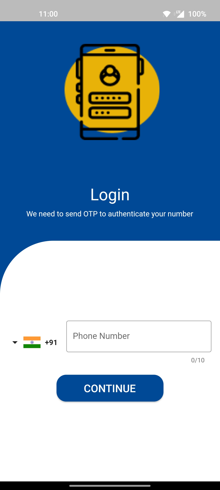

# FeetWings Auth

- The FeetWings App Authentication is a frontend application developed using Flutter and Firebase.
- It provides a seamless and secure user authentication experience for the FeetWings app, ensuring that users can safely access the app's features and services using OTP.
- [📦.apk](https://github.com/Akshit1903/FeetWings/raw/main/app-release.apk) :For testing purposes
- [📽️YouTube]() Video

## Screenshots



## Features

- User Registration and login: New users can create an account by providing their phone number.
- OTP login- Authentication is done using OTP received by SMS.

## Installation

- Clone the repository:
  ```shell
  git clone https://github.com/Akshit1903/FeetWings
  ```
- Navigate to the project directory:
  ```shell
  cd FeetWings
  ```
- Install the required dependencies:
  ```shell
  flutter pub get
  ```
- Configure a device and run the app

  ```shell
  flutter run
  ```

  Alternativly, you can download `.apk` file from <a href="https://github.com/Akshit1903/FeetWings/raw/main/app-release.apk"> here</a> and follow the steps:

- Launch the FeetWings App Authentication on your mobile device.
- Provide your phone number to begin the registration process.
- Enter the OTP that is received by SMS.
- Enjoy using the FeetWings app with a secure and seamless authentication experience!
